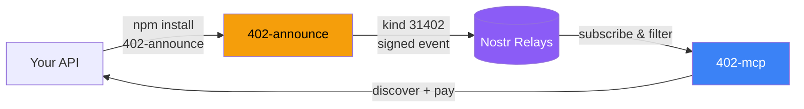
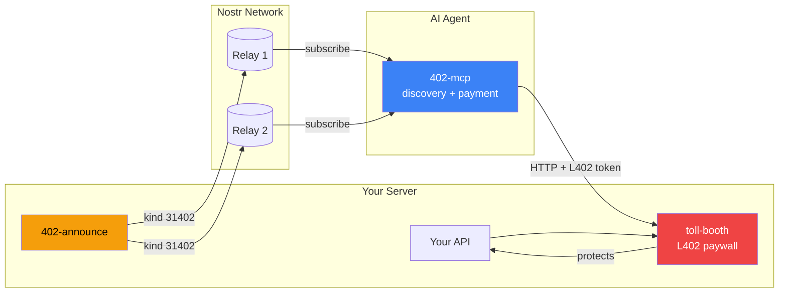
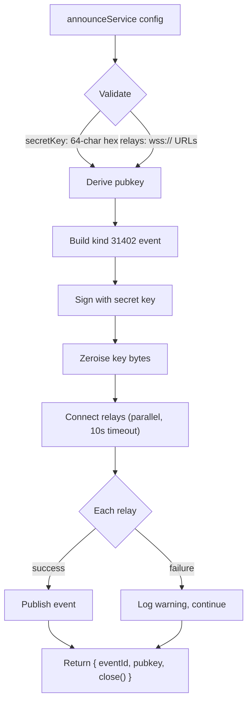
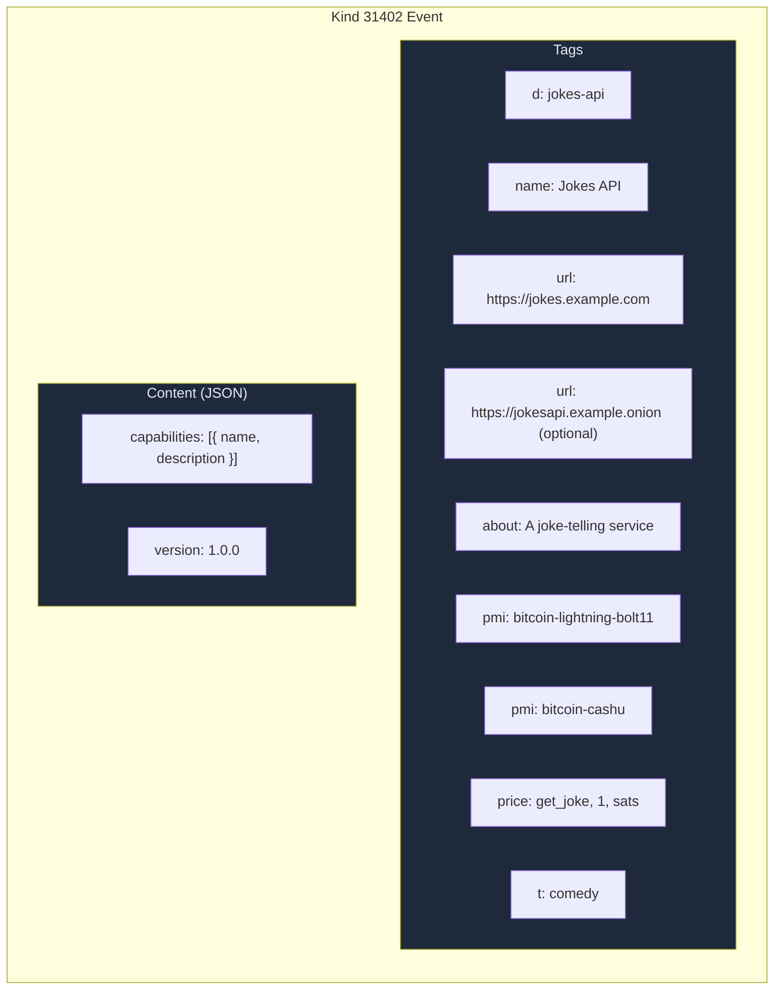

# 402-announce

Announce HTTP 402 services on Nostr for decentralised discovery. Supports both L402 and x402 payment protocols.

[](https://github.com/forgesworn/402-announce/actions/workflows/ci.yml)
[](./README.md)
[](./LICENSE)

Publishes **kind 31402** parameterised replaceable events so that AI agents (and any Nostr client) can discover paid APIs without a central registry.

**[Live Dashboard](https://402.pub)** — see every service announcing on the network right now.

## How it works



Your API publishes a service announcement to Nostr relays. AI agents (via [402-mcp](https://github.com/forgesworn/402-mcp)) discover it, pay the invoice, and consume the API. No central registry required.

## Quick start

```bash
npm install 402-announce
```

```typescript
import { announceService } from '402-announce'

const handle = await announceService({
  secretKey: '64-char-hex-nostr-secret-key',
  relays: ['wss://relay.damus.io', 'wss://relay.primal.net'],
  identifier: 'jokes-api',
  name: 'Jokes API',
  urls: ['https://jokes.example.com'],
  about: 'A joke-telling service behind an L402 paywall',
  pricing: [
    { capability: 'get_joke', price: 1, currency: 'sats' },
  ],
  paymentMethods: ['bitcoin-lightning-bolt11', 'bitcoin-cashu', 'bitcoin-cashu-xcashu'],
  topics: ['comedy', 'ai'],
  capabilities: [
    { name: 'get_joke', description: 'Returns a random joke' },
  ],
  version: '1.0.0',
})

console.log('Published event:', handle.eventId)
console.log('From pubkey:', handle.pubkey)

// Later, when shutting down:
handle.close()
```

**Multi-transport example** (clearnet + Tor + Handshake — same service, different access paths):

```typescript
const handle = await announceService({
  secretKey: '64-char-hex-nostr-secret-key',
  relays: ['wss://relay.damus.io', 'wss://relay.primal.net'],
  identifier: 'jokes-api',
  name: 'Jokes API',
  urls: [
    'https://jokes.example.com',                  // clearnet
    'http://jokesxyz...onion',                    // Tor hidden service
    'https://jokes.example.hns',                  // Handshake domain
  ],
  about: 'A joke-telling service behind an L402 paywall',
  pricing: [{ capability: 'get_joke', price: 1, currency: 'sats' }],
  paymentMethods: ['bitcoin-lightning-bolt11'],
  topics: ['comedy', 'ai'],
})
```

Each URL becomes a separate `url` tag in the kind 31402 event. Clients try them in order and use whichever they can reach. `urls` accepts 1–10 entries; any parseable URL is valid.

See [`examples/`](./examples) for runnable scripts.

## How it fits together



1. **[toll-booth](https://github.com/forgesworn/toll-booth)** wraps your API with an L402 paywall
2. **402-announce** publishes a kind 31402 event describing the service, pricing, and payment methods
3. **[402-mcp](https://github.com/forgesworn/402-mcp)** discovers the announcement, pays the invoice, and calls your API

## What it does

- Builds and signs kind 31402 Nostr events
- Publishes to one or more Nostr relays in parallel
- Zeroises secret key bytes after use
- Degrades gracefully when individual relays fail
- Provides a `close()` handle for clean disconnection

## What it does not do

- Does not run an L402 paywall (use [toll-booth](https://github.com/forgesworn/toll-booth) for that)
- Does not subscribe to or search for announcements (use [402-mcp](https://github.com/forgesworn/402-mcp) for that)
- Does not handle payments or token verification

## API

### `announceService(config): Promise<Announcement>`

High-level function that builds, signs, and publishes the event to multiple relays.

**Returns** an `Announcement` handle:
- `eventId` — the published Nostr event ID
- `pubkey` — the Nostr pubkey derived from your secret key
- `close()` — disconnect from all relays

### `buildAnnounceEvent(secretKey, config): VerifiedEvent`

Lower-level function that builds and signs the event without publishing. Useful if you manage relay connections yourself.

### Config options

| Field            | Type              | Required | Description                                    |
|------------------|-------------------|----------|------------------------------------------------|
| `secretKey`      | `string`          | yes      | 64-char hex Nostr secret key                   |
| `relays`         | `string[]`        | yes      | Relay URLs (`wss://` or `ws://`)               |
| `identifier`     | `string`          | yes      | Unique listing ID (Nostr `d` tag)              |
| `name`           | `string`          | yes      | Human-readable service name                    |
| `urls`           | `string[]`        | yes      | HTTP endpoints for the service (1–10 entries, any parseable URL) |
| `about`          | `string`          | yes      | Short description                              |
| `pricing`        | `PricingDef[]`    | yes      | Per-capability pricing                         |
| `paymentMethods` | `string[]`        | yes      | Accepted payment methods                       |
| `picture`        | `string`          | no       | Icon URL                                       |
| `topics`         | `string[]`        | no       | Topic tags for filtering                       |
| `capabilities`   | `CapabilityDef[]` | no       | Capability details (stored in event content)   |
| `version`        | `string`          | no       | Service version (stored in event content)      |

## Announce flow



## Event format

Each announcement is a **kind 31402** parameterised replaceable event. The combination of `pubkey` + `d` tag uniquely identifies a listing — publishing again with the same values updates the existing listing.



### Tags

| Tag       | Required | Description                                  | Example                           |
|-----------|----------|----------------------------------------------|-----------------------------------|
| `d`       | yes      | Unique identifier for this listing           | `jokes-api`                       |
| `name`    | yes      | Human-readable service name                  | `Jokes API`                       |
| `url`     | yes      | HTTP endpoint (one tag per URL; repeatable)  | `https://jokes.example.com`       |
| `about`   | yes      | Short description                            | `A joke-telling service`          |
| `pmi`     | yes      | Payment method identifier (repeatable)       | `bitcoin-lightning-bolt11`        |
| `price`   | yes      | Capability pricing (repeatable)              | `get_joke`, `1`, `sats`           |
| `t`       | no       | Topic tag for search/filtering (repeatable)  | `comedy`                          |
| `picture` | no       | Icon URL                                     | `https://example.com/icon.png`    |

### Recognised Payment Method Identifiers

| Identifier | Description |
|------------|-------------|
| `bitcoin-lightning-bolt11` | Lightning Network (BOLT-11 invoices) |
| `bitcoin-cashu` | Cashu ecash (generic) |
| `bitcoin-cashu-xcashu` | Cashu ecash via NUT-24 (X-Cashu header) |
| `x402-evm` | x402 stablecoin payments (EVM chains) |

### Content

The event content is a JSON object with optional fields:

```json
{
  "capabilities": [
    { "name": "get_joke", "description": "Returns a random joke" }
  ],
  "version": "1.0.0"
}
```

## Multiple URLs vs multiple events

This distinction is important for operators:

**Multiple URLs in one event** — use `urls: ['...', '...']` when the URLs represent the **same service** on different transports (clearnet, Tor, Handshake). The pricing, credentials, and macaroon signing key are identical. Clients pick whichever URL they can reach. This is for censorship resistance and redundancy.

**Separate kind 31402 events** — publish a new event (different `identifier`) when you have **genuinely different services**: different pricing tiers per transport, different capabilities, or services that operate independently. A single event should describe one logical service.

In short: same service + different network paths → one event with multiple `url` tags. Different services → separate events.

## Security

- Secret key bytes are zeroised immediately after signing (in both `announceService` and `buildAnnounceEvent`)
- Never log or persist the secret key — pass it in and let the library handle cleanup
- Relay connections use a 10-second timeout to prevent hanging
- Individual relay failures are logged as warnings but don't reject the promise

## Ecosystem

| Package | Purpose |
|---------|---------|
| [toll-booth](https://github.com/forgesworn/toll-booth) | L402 middleware — any API becomes a toll booth in minutes |
| [toll-booth-announce](https://github.com/forgesworn/toll-booth-announce) | Bridge — announce toll-booth services with one function call |
| [satgate](https://github.com/forgesworn/satsgate) | Production L402 gateway with Lightning and Cashu support |
| [402-mcp](https://github.com/forgesworn/402-mcp) | MCP server for AI agents to discover, pay, and consume 402 APIs |
| [Live Dashboard](https://402.pub) | See every service announcing on the network |

## Licence

[MIT](./LICENSE)
